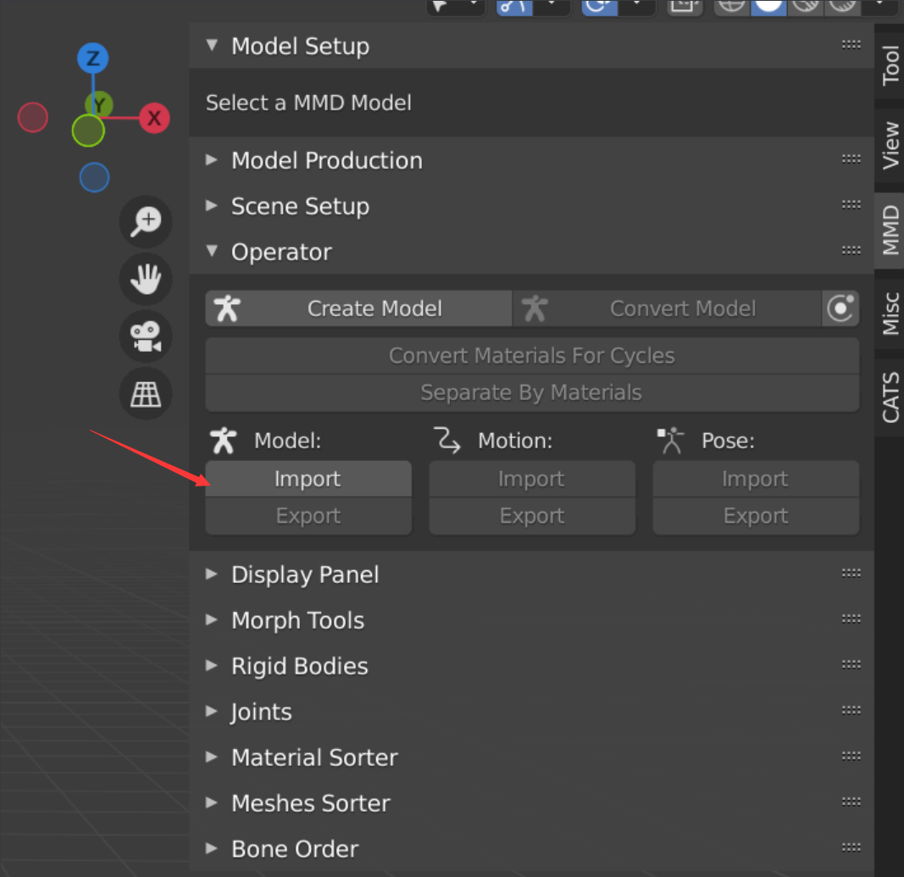
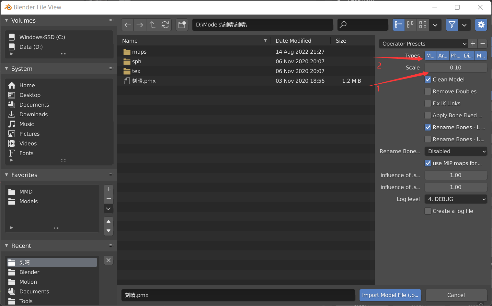

# MMD动作模型导入Unity

首先是正常通过MMD4mecanim插件导入模型，该插件的安装与操作见[微冷的教学](https://www.bilibili.com/video/BV1Db411e74e?vd_source=8c347f74b9397d7346344dcd54b81889)。

与视频不同的是，在准备导入前将你需要的动作vmd文件放进去。

若完成视频中的操作，现在你应该拿到了一个带有Animation Clip的fbx模型。

如果你想对模型的材质进行操作，步骤如下

然后你会得到一个自动生成的Materials文件夹，里面就有导出的材质。

这就是正常的导入流程。但你很明显会看出一个问题：**插件生成的材质在SRP环境下会出现喜闻乐见的bug紫 : ) **。

这时候你想：那么我用默认渲染管线不就行了。这样当然可以解决bug紫问题，但起码还有两个问题。

1. 由于该插件大概率不会自动给你的材质上贴图，所以你需要自己手动一个一个贴，很无聊不是吗。（当然，如果你把这个过程想象成给老婆换衣服，大概也许可能就不会那么无聊了）
2. 插件生成的fbx模型过于粗糙，不太能满足自定义的需求。

*这是自行导入的模型，明显比插件导入的模型更细。*

总之，我们需要的是**自己导入的模型 + 插件导入的动作**。下面就来讲讲如何拿到它们并且组合到一起。

## fbx模型的导入

在这一部分，你需要准备的是blender 2.93.5 + cats插件。它们的安装见[这篇博客](https://blog.csdn.net/linxinfa/article/details/121370565)的**blender下载与安装**和**cats插件的下载与安装**两部分。

> cats插件在3.0版以后的blender中的使用似乎有bug。所以请安装2.93.5版本的blender。

**注意，从现在开始，请严格按照我的步骤来操作，不然很可能会碰见各种各样的问题。**

**我并不保证自己的步骤是最优的，所以其中可能存在一些不必要的步骤。但我可以保证的是，它行得通。**

安装完成blender并导入插件之后，首先把场景清空。

> blender操作提示：
>
> 长按鼠标滚轮 + 移动鼠标——旋转窗口
>
> Shift + 长按鼠标滚轮 + 移动鼠标—— 平移窗口
>
> a —— 全选
>
> x —— 删除选中物体
>
> n —— 呼出右侧边栏

然后呼出右侧边栏，通过**MMD插件中的Operator模块**导入pmx模型。

这里存在两个注意点：

1. Scale模型大小默认是1，我们改成0.1。
2. Types全选上。如果选择了一个而另外一个消失了，那么按住Shift键选择。（这点和平常的按住Ctrl选择不一样）

导入完成之后，你的界面应该是这个样子。然后点击右上角我圈出来的位置右边的下拉菜单，隐藏Bones骨骼。

点击模型**（注意不是按a全选）**。在此状态下，找到Morph Tools中的Bind，点击它。

再次点击模型，在此状态下点击Operator中的Convert Materials For Cycles。

此时左下角会出现一个框框，在里面勾选Convert to Principled BSDF。

> 如果不做这一步，导入unity后，模型可能会成为灰模

仍然是在模型被选中的情况下，点击下方的Separate By Materials

> 如果不做这一步，导入unity后，模型不会细分。

然后在右边选中模型的arm部分，在左下角切换到Text Editor模式，上拉，导入[一段python脚本](https://github.com/chomstudio/mmdbone_rename.blender/blob/master/mmdbone_rename.py)，点击运行。

> 如果不做这一步，导入unity后，模型的骨骼不会移动。

最后是模型的导出，按a全选模型，在Cats界面选择Export Model，**在弹出的导出界面中勾选Selected Objects**。

> 如果不这样做，mme_tools_rigids会一起导出为fbx。你的老婆就会变成身穿铠甲的卡面来打（雾）。

现在，首先将模型的贴图拖入unity，然后再将fbx模型拖入。一切正常的话，你会得到一个有贴图的fbx模型。

*（要是还不正常，请返回仔细检查你的操作。如果操作实在没有偏差，说明出现我没碰见的问题了 ：）*

点击右上角的Rig，将Generic转为Humanoid，点击apply。完成之后，你会发现模型中多了一个Avator。

> 如果这一步报错的话，一定要返回检查步骤。

至此，模型的导入工作完成。

## vmd动作的导入

使用MMD4mecanim插件导入**相同的**pmx模型，拿到插件导出的fbx文件中的Animation Clip即可。

## 模型 + 动作

将第一阶段导入的有贴图的fbx模型拖入场景。将第二阶段得到的Animation Clip拖到场景中的模型中去。此时你会得到一个Animation Controller。点击中上方的Play，进入Game模式，你的老婆就可以动起来了。

